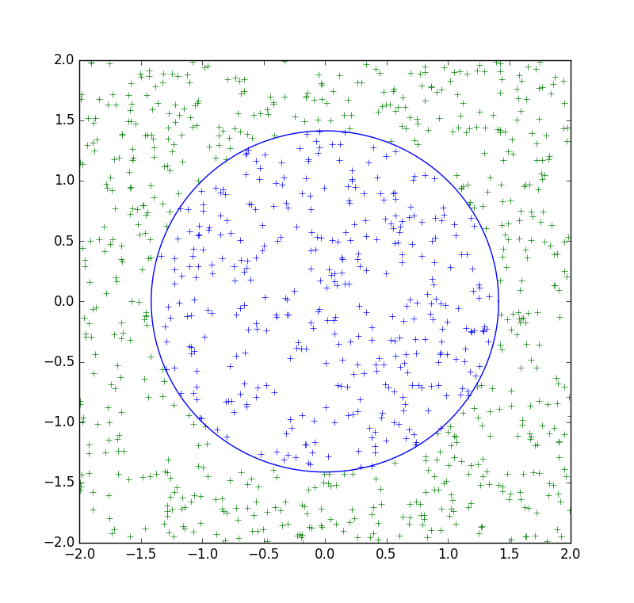
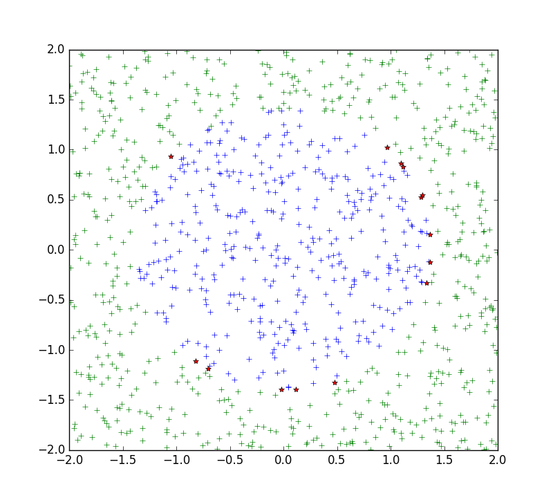
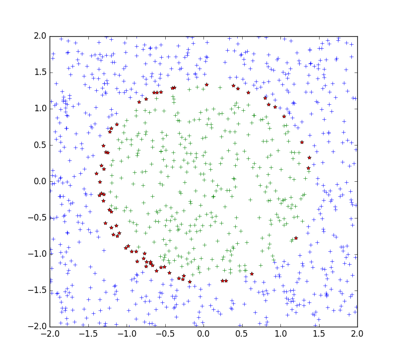

#熟悉Keras的一系列的操作

### dataMaker.py
造数据的脚本，造出来的数据如图所示。

### lesson1_preview.py
使用自己设计的神经网络训练，在100次迭代之后，在测试机上的数据达到了99.1%。
使用matplotlib绘出测试结果，红色*号标记的是错分类点。

### lesson2_SVM.py
对于dataMaker.py造出来的数据，使用支持向量机（SVM）进行分类，准确率达到了95.5%
使用matplotlib绘出测试结果，红色*号标记的是错分类点。

明显看出支持向量机对于这种非线性分类还是不行，准确率不够高。

### lesson_CNN.py
使用Mnist手写字母数据集训练卷积神经网络。准确率达到了99.3%。
并且保存模型。

### lesson_loadModel.py
熟悉keras导入模型，进行预测。

### lesson5_ImgPreprocess.py
对于自己使用手机拍摄的手写字母照片，进行预处理，并且拿去预测。
